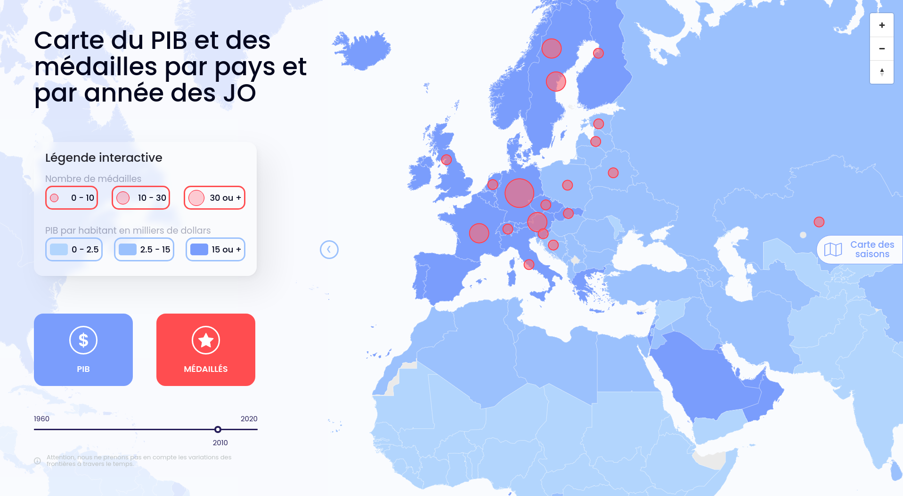

# KTK Data visualization Backend

Link to online site : http://vps-080d9e1e.vps.ovh.net:3100/  
Link root api : http://vps-080d9e1e.vps.ovh.net:3000/  
Frontend of the data visualization project : [Frontend](https://github.com/Coyls/ktk-dataviz-frontend/)

---

## Environment

To duplicate the project locally you will need [Node/NPM](https://nodejs.dev/), [Docker/Docker-compose](https://www.docker.com/)

Replace the file `.env.example` by `.env`

```s
NODE_ENV = develop
USER_NEO4J = neo4j
MDP_NEOJ4 = password

NEO4J_AUTH = neo4j/password
COMMAND_SERVER = npm start
```

`DATA_JSON` and `DATA_RAW` you will need the absolute path to the folder raw-data and data-json.

Exemple :

```s
DATA_JSON = "/home/user/datavise/database/data-json/"
DATA_RAW = "/home/user/datavise/database/raw-data/"
```

---

## Initialisation database

First you have to generate the csv to fill the database.

```bash
npm run generate-csv 
```

Then you have to unlock the folder import in the database and copy the csv.

```bash
npm run unlock-import
npm run copy-import
```

## Docker

Now build and run docker

```bash
docker-compose build
docker-compose up -d
```

When the container are up go on [http://localhost:7474](http://localhost:7474)

Connect with the user and password you use in the `.env`

You will have to run the cypher scripts to create the graph.  
Go on the file [script.cypher](./database/script.cypher) and copy each block one by one and execute on neo4j.  

To shut down

```bash
docker-compose down
```

Now you can run the [frontend](https://github.com/Coyls/ktk-dataviz-frontend/)
